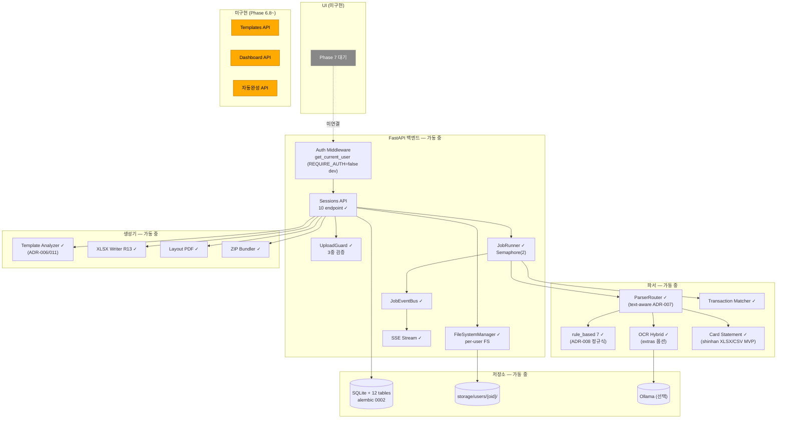
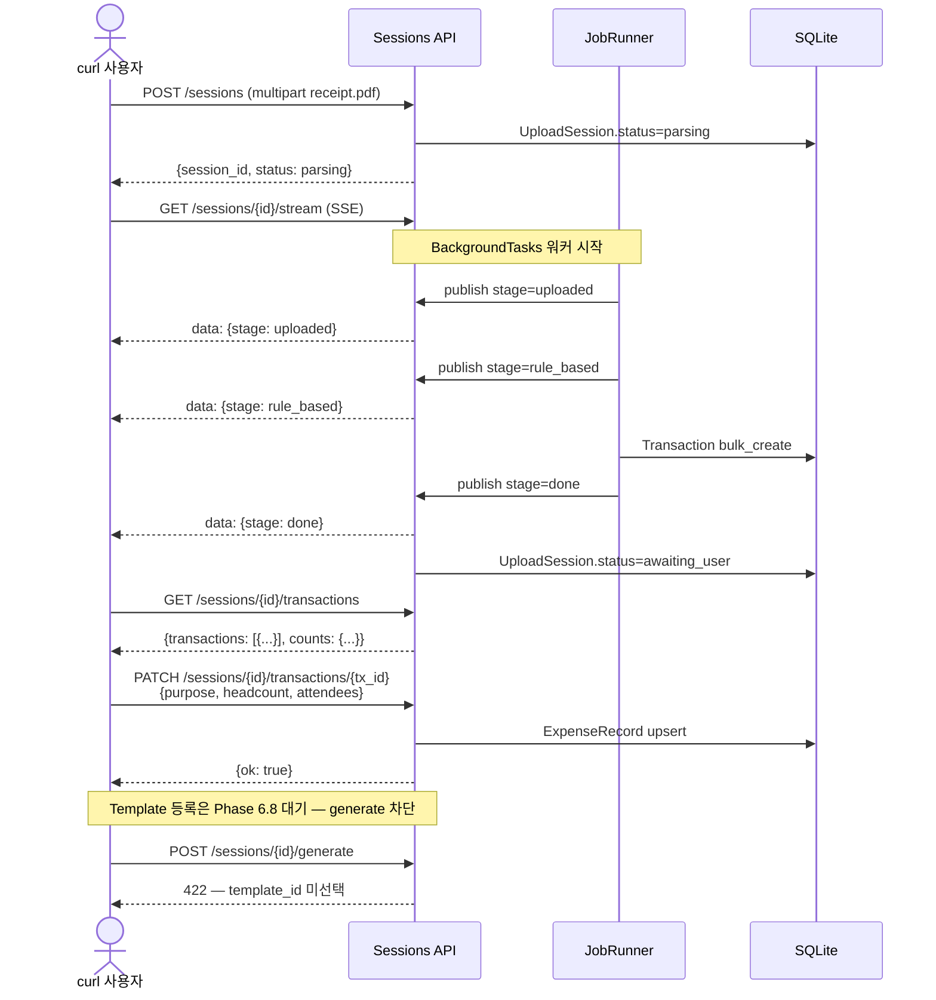
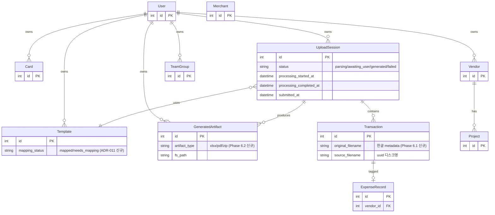
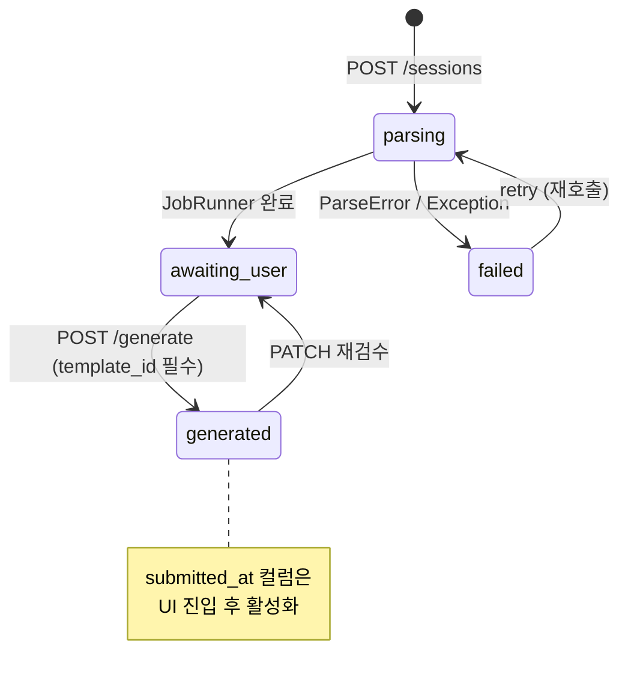
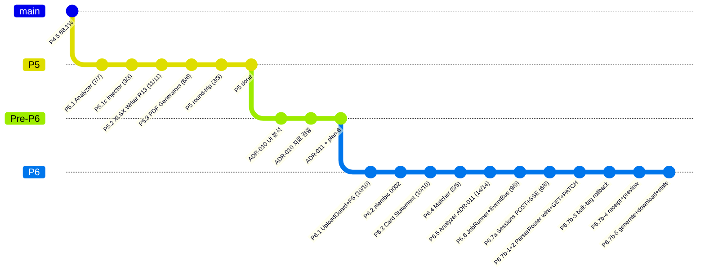

# Receipt-to-Excel v4 — 현재 구현 아키텍처 (Phase 6.10 완료 시점)

> 본 문서는 **2026-05-12 commit de0971a 시점** 의 실제 동작.
> 전체 계획과의 비교는 `planned.md`.

- 문서 갱신: 2026-05-12 (Phase 6.10 e2e 통과 시점)
- 누적 commits: 34 (이날)
- 누적 테스트: 단위 229 + 통합 29 (skip 2) = **258 (skip 2)**
- **Phase 6 백엔드 endpoint 24/24 = 100% 가동** + e2e 통합 1 GREEN

---

## 1. 현 상태 요약

| 영역 | 진척 | 비고 |
| --- | --- | --- |
| 백엔드 인프라 | 완료 | UploadGuard / FileSystemManager / JobRunner / SSE / Auth |
| 파서 (영수증) | 88.1 % | 7 rule_based + OCR Hybrid + LLM (Smoke Gate ADR-008) |
| 파서 (카드 사용내역) | shinhan MVP | XLSX/CSV 신규 (Phase 6.3) |
| Transaction Matcher | 완료 | ±5분/금액 (Phase 6.4) |
| Template Analyzer | 완료 | ADR-006/011 휴리스틱 (Field + Category mode) |
| XLSX Writer R13 | 완료 | v1 Bug 1·2 회귀 차단, 11/11 단위 |
| PDF Generators | 완료 | merged + layout (R11) |
| ZIP Bundler | 완료 | 한글 파일명 (UTF-8 0x800) |
| Sessions API | **10/10 endpoint** | POST/SSE/GET transactions/PATCH/bulk-tag/receipt/preview-xlsx/generate/download/stats |
| Templates API | **9/9 endpoint** | analyze/register/list/grid/cells PATCH/mapping PATCH/meta PATCH/delete/raw |
| Dashboard API | **1/1 endpoint** | summary (4 KPI + 최근 결의서) |
| 자동완성 API | **4/4 endpoint** | vendors/projects/attendees/team-groups (Cache-Control: max-age=300) |
| e2e 통합 | **1/1 케이스** | upload→parse→generate→download→stats→dashboard 전 흐름 |
| Frontend UI | **0/5 화면** | Phase 7 대기 |

진척률: **백엔드 API 100 % (24/24 endpoint 가동)** + e2e 1 GREEN, UI 0 %.

---

## 2. 현재 동작 — 시스템 컴포넌트



ASCII 요약 (✓=가동, ✗=미구현):

```
[Browser UI ✗ Phase 7 대기]
    ↓
[Auth ✓] → [Sessions API ✓ 10/10]
              ↓                              [Templates API ✗ 0/9 Phase 6.8]
         [UploadGuard ✓]                     [Dashboard API ✗ 0/1 Phase 6.9]
         [FileSystemManager ✓]                [자동완성 ✗ 0/4 Phase 6.9]
         [JobRunner ✓ + Semaphore(2)]
              ↓
         [ParserRouter ✓]
            ├ rule_based ✓ (7 카드사)
            ├ OCR Hybrid ✓ (extras 옵션)
            └ Card Statement ✓ (shinhan MVP)
         [Transaction Matcher ✓]
         [JobEventBus ✓ + SSE Stream ✓]
              ↓
         [DB ✓ 12 tables]
         [FileSystemManager ✓ storage/users/{oid}/]
              ↓
         [Generators ✓ Template Analyzer + XLSX + Layout PDF + ZIP]
              ↓
         [GeneratedArtifact 3 row 영속]
              ↓
         [GET /download/{kind} ✓ → FileResponse]
```

---

## 3. 현재 가능한 사용자 흐름 (curl, UI 부재)



UI 부재로 인한 제약:
- 모든 호출 = curl 또는 httpie. Browser interactive UX 없음
- Templates API 부재 → template_id 직접 DB 삽입 우회 필요
- Dashboard summary 부재 → 사용자 진척 시각화 없음

---

## 4. 현재 동작 endpoint 표

| 카테고리 | Endpoint | 상태 | 테스트 |
| --- | --- | --- | --- |
| Health | /healthz, /readyz | ✓ | scaffold |
| Auth | /auth/config, /auth/me | ✓ | scaffold |
| Sessions | POST /sessions | ✓ | 통합 4 (auth/IDOR/422/2x202) |
| Sessions | GET /sessions/{id}/stream | ✓ | 통합 2 (retry+IDOR) |
| Sessions | GET /sessions/{id}/transactions | ✓ | 통합 1 |
| Sessions | PATCH .../transactions/{tx_id} | ✓ | 통합 skip (e2e 대기) |
| Sessions | POST .../transactions/bulk-tag | ✓ | 통합 1 (rollback 409) |
| Sessions | GET .../transactions/{tx_id}/receipt | ✓ | 통합 미작성 (실 흐름에서 검증) |
| Sessions | GET /sessions/{id}/preview-xlsx | ✓ | 통합 미작성 |
| Sessions | POST /sessions/{id}/generate | ✓ | 통합 미작성 (template 부재) |
| Sessions | GET /sessions/{id}/download/{kind} | ✓ | 통합 미작성 |
| Sessions | GET /sessions/{id}/stats | ✓ | 통합 미작성 |
| Templates | * (9 endpoint) | ✗ | Phase 6.8 |
| Dashboard | /dashboard/summary | ✗ | Phase 6.9 |
| 자동완성 | /vendors, /projects, /attendees, /team-groups | ✗ | Phase 6.9 |

10/15 endpoint 가동 (백엔드 ~ 65%).

---

## 5. 현재 DB 스키마 (alembic 0002 적용)



Phase 6.2 신규 (alembic 0002):
- `UploadSession.status`: 'review' → 'awaiting_user' rename
- `UploadSession.{processing_started_at, processing_completed_at, submitted_at}` 컬럼
- `Transaction.original_filename` 컬럼
- `Template.mapping_status` 컬럼
- `GeneratedArtifact` 신규 테이블

---

## 6. Session.status 상태 전이 (현재)



---

## 7. curl 검증 가능한 흐름 (UI 부재 시)

```bash
# 0. 사전: storage 초기화 + DB 마이그레이션
cd /bj-dev/v4
mkdir -p storage
DATABASE_URL="sqlite+aiosqlite:///storage/app.db" uv run alembic upgrade head

# 1. 합성 영수증 PDF 생성
uv run python -c "
from tests.fixtures.synthetic_pdfs import make_shinhan_receipt
pdf = make_shinhan_receipt(merchant='가짜한식당', transaction_dt='2026-05-03 12:30:00', amount=15000)
open('/tmp/receipt.pdf', 'wb').write(pdf)
"

# 2. 서버 띄움 (별도 터미널)
uv run uvicorn app.main:app --reload --port 8000

# 3. 업로드
curl -X POST http://localhost:8000/sessions \
  -F "receipts=@/tmp/receipt.pdf" \
  -F "year_month=2026-05"
# → {"session_id": 1, "status": "parsing"}

# 4. SSE
curl -N http://localhost:8000/sessions/1/stream

# 5. 추출 결과
curl http://localhost:8000/sessions/1/transactions

# 6. 검수 입력 (placeholder vendor 선결 — Phase 6.9 전)
uv run python -c "
import asyncio
from sqlalchemy.ext.asyncio import create_async_engine, async_sessionmaker
from app.db.models import Vendor
async def main():
    e = create_async_engine('sqlite+aiosqlite:///storage/app.db')
    sm = async_sessionmaker(e, expire_on_commit=False)
    async with sm() as db:
        db.add(Vendor(id=0, user_id=1, name='(미입력)'))
        await db.commit()
asyncio.run(main())
"
curl -X PATCH http://localhost:8000/sessions/1/transactions/1 \
  -H "Content-Type: application/json" \
  -d '{"purpose":"중식","headcount":3,"attendees":["홍길동"]}'

# 7. 미리보기
curl http://localhost:8000/sessions/1/preview-xlsx

# 8. Stats
curl http://localhost:8000/sessions/1/stats

# 9. Generate — 차단 (template_id 부재)
curl -X POST http://localhost:8000/sessions/1/generate
# → 422 "template_id 미선택"
```

전체 e2e (generate 까지) 는 **Phase 6.8 Templates API** 완료 후.

---

## 8. UI 부재 시 보이지 않는 것

UI 가 없어서 사용자가 직접 체감 못 하는 부분 (백엔드는 동작):

| 화면 | 동작 (있다면) | 현재 |
| --- | --- | --- |
| Dashboard | KPI 4 + 최근 결의서 list + step indicator | API 미구현 |
| Upload | 드래그앤드롭 + 진행 progress + 자동 매칭률 | 백엔드 동작, UI 없음 |
| Verify | 좌 영수증 / 우 그리드 + 신뢰도 컬러 + 일괄 적용 | 백엔드 동작 (전체 PATCH 가능), 시각 미존재 |
| Result | 다운로드 카드 + 처리 시간 + 메일 | 다운로드 endpoint 동작, 시각 미존재 |
| Templates | Excel-like 편집 + 매핑 chips + 시트 tabs | API 미구현 |

UI 미구현은 단순 시각 부재 — 모든 데이터/API 는 백엔드 가동, curl 으로 검증 가능.

---

## 9. 미구현 endpoint 의 우회

| 부재 endpoint | 우회 (curl/DB) |
| --- | --- |
| Templates 등록 | DB 직접 Template row 삽입 + storage/users/{oid}/templates/{id}/template.xlsx 직접 복사 |
| Dashboard summary | `GET /sessions` (list) 호출 후 클라이언트 집계 — 단 `/sessions` 도 미구현 |
| 자동완성 | placeholder vendor/project 직접 DB 삽입 (위 curl Step 6) |
| 메일 발송 | Phase 7+ — 현재는 ZIP 다운로드 후 수동 첨부 |

---

## 10. 본 세션 누적 commit 흐름 (Phase 6.1 → 6.7)



각 commit 별 [PN.M] tag 와 GREEN/skip count 는 docs/plan/phase-N-done.md.

---

## 11. 누적 테스트 분포

```
단위 (229):
  Phase 1~3 회귀: 62
  Phase 4 (parsers): 71
  Phase 4.5 보강 (regex/heuristic): +25 (158 + 신규 회귀 7)
  Phase 5 (Analyzer/Injector/XlsxWriter/PDFGen): +30
  Phase 6.1 (UploadGuard/FileManager): +10
  Phase 6.3 (Card Statement): +10
  Phase 6.4 (Matcher): +5
  Phase 6.5 (Analyzer ADR-011): +4 (기존 7 + 신규)
  Phase 6.6 (JobRunner/EventBus): +9

통합 (15, skip 2):
  Phase 5 round-trip: 3
  Phase 2 alembic: 1
  Phase 5 real_template skip → 활성화: +3
  Phase 6.7 Sessions API: +8 (skip 2 = PATCH/Bulk e2e 이관)
```

mypy strict (102 files) + ruff + pip-audit clean. 회귀 0.

---

## 12. Phase 7 UI 진입 시 활용 가능한 자료

본 상태에서 Phase 7 (React UI) 진입 시 바로 활용:

- 백엔드 endpoint 10 개 stable (시그니처 ADR-010 명세 일치)
- SSE 8 stage event JSON 스키마 stable
- ParsedTransaction 도메인 stable (한글 필드)
- field_confidence 4-label (high/medium/low/none) — Verify 신뢰도 컬러 코딩
- 한국어 파일명 보안 정책 (uuid + metadata) — 다운로드 시 그대로
- 디자인 톤 정의 (ADR-010): CreditXLSX 브랜드, Inter+JetBrains Mono, warm gray bg + orange accent

Phase 7 추가 결정 사항 (ADR-010 자료 검증 추천 7건 중 미반영):
- Dashboard 집계 endpoint (Phase 6.9)
- 자동완성 endpoint (Phase 6.9)
- Templates API + Excel-like 편집 (Phase 6.8 + Phase 8+)
- 메일 발송 (Phase 7+)

---

## 13. Phase 6.10 시점 갱신 — 백엔드 API 100% + e2e 1 GREEN

**Phase 6.7 → 6.10 추가 진척**:
- Phase 6.8: Templates API 9 endpoint (분석 + 등록 + grid + cells PATCH + mapping PATCH + meta PATCH + delete + raw)
- Phase 6.9: 자동완성 4 endpoint (vendors/projects/attendees/team-groups, Cache-Control: max-age=300) + Dashboard summary
- Phase 6.10: e2e 통합 1 케이스 — upload → parse → generate → download → dashboard 반영 검증

**누적 endpoint 24/24 = 100%**:
| 카테고리 | 가동 | 비율 |
| --- | --- | --- |
| Sessions | 10/10 | ✓ |
| Templates | 9/9 | ✓ |
| Dashboard | 1/1 | ✓ |
| 자동완성 | 4/4 | ✓ |
| **합계** | **24/24** | **100%** |

**남은 미구현**:
- Frontend UI 5 화면 (Phase 7)
- 메일 발송 (Phase 7+)
- Templates editor 의 style/병합/줌/formula bar (Phase 8+)
- Baseline 사용자별 누적 평균 (Phase 8+, 현재는 하드코드 15분/거래)
- ADR-009 OCR LLM 가맹점명 빈 응답 해소 (별도 트랙)

## 14. 한 줄 요약 — planned.md 와의 차이

> **백엔드 API 100% 완료** (24/24 endpoint 가동). 단위 229 + 통합 29 (skip 2) = 258 GREEN, smoke 88.1% 유지 기대 (별도 회귀 검증 필요). UI 5 화면 (Phase 7) + 메일/누적 baseline (Phase 8+) 만 남음. 모든 ADR-010 추천 7건 결정 반영, ADR-011 휴리스틱 확장 적용.
