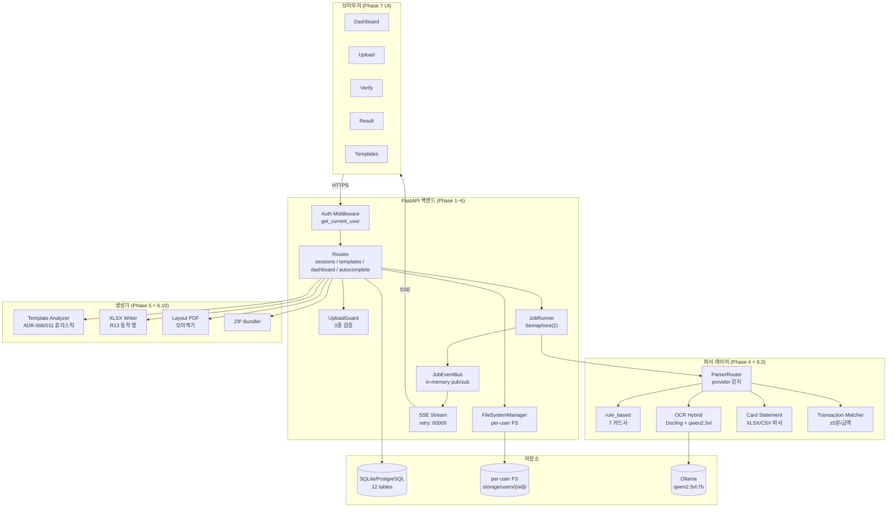
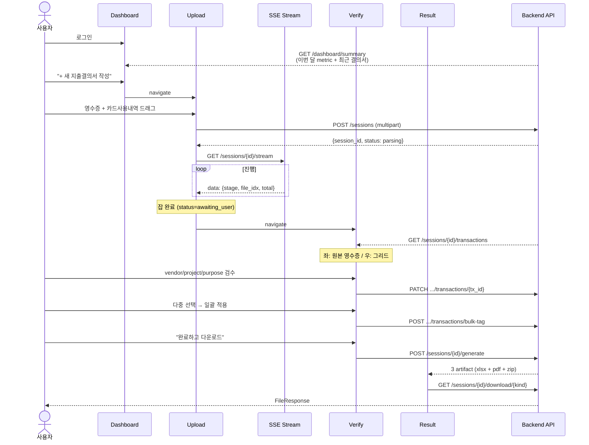
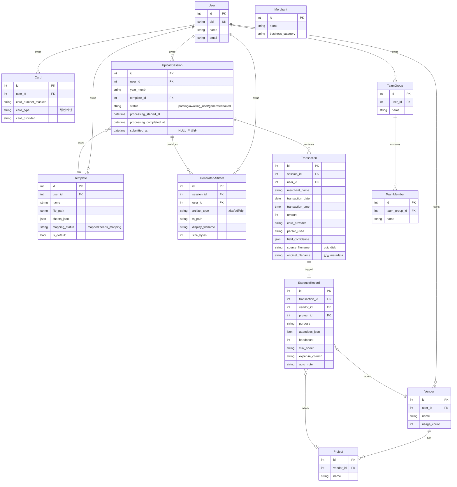
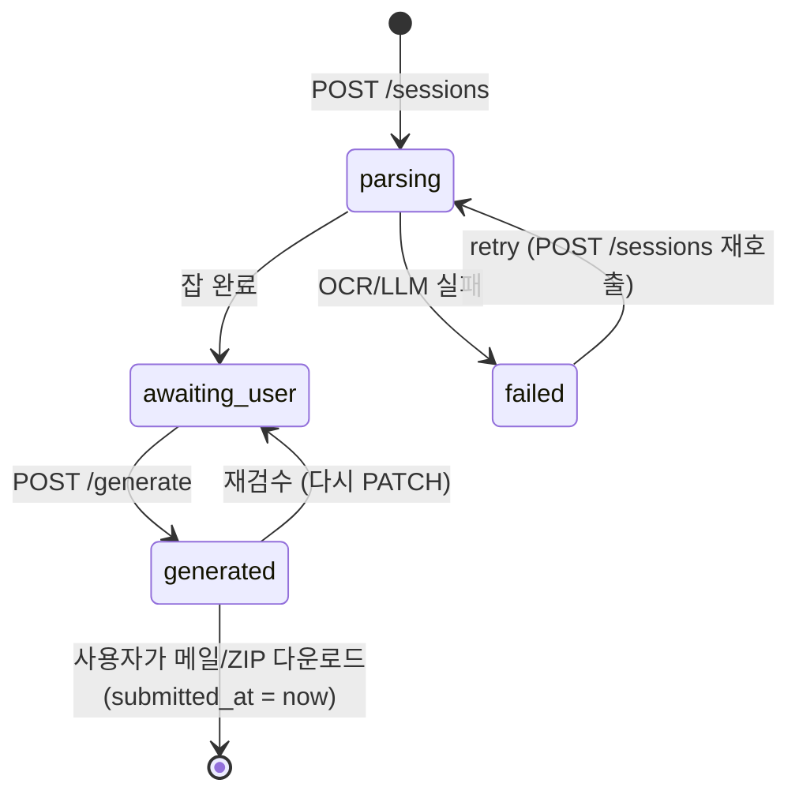

# Receipt-to-Excel v4 — 계획 아키텍처 + 사용자 흐름 + 예상 UI

> 본 문서는 Phase 1~7 (백엔드 + UI 본격 구현 후) 의 **최종 그림**.
> 현재 구현 진척과의 비교는 `current.md` 참조.

- 문서 갱신: 2026-05-12
- 참조: synthesis/05-implementation-plan.md, ADR-006/007/008/010/011, docs/plan/phase-N-plan.md

---

## 1. 큰 그림 — 시스템 컴포넌트



ASCII 요약:

```
[Browser UI]
    ↓ HTTPS
[Auth Middleware] → [Routes] → [UploadGuard] → [FileSystemManager] → [storage/users/{oid}/]
                       ↓
                  [JobRunner] → [ParserRouter] → [rule_based / OCR Hybrid / Card Statement]
                       ↓                                ↓
                  [JobEventBus] ← SSE                [Ollama]
                       ↓
                  [Transaction Matcher]
                       ↓
                  [DB: 12 tables]
                       ↓
                  [Generators: Template Analyzer + XLSX Writer + Layout PDF + ZIP]
                       ↓
                  [FileResponse 다운로드]
```

---

## 2. 사용자 흐름 — 5 화면



UI step indicator (모든 화면 상단):

```
①  업로드   →   ②  검수·수정   →   ③  다운로드
```

Session.status 매핑:
- `parsing` → ① 업로드 (활성, SSE 진행)
- `awaiting_user` → ② 검수·수정 (활성)
- `generated` → ③ 다운로드 (활성, Result 화면)
- `failed` → 에러 모달 (잡 실패, retry 가능)
- `submitted_at IS NOT NULL` → Dashboard "제출완료" 라벨

---

## 3. 컴포넌트 상세

### 3.1. Auth Layer (Phase 1)
- `app/api/deps.py::get_current_user` — Azure AD JWT 검증 → `UserInfo(oid, name, email)`
- `REQUIRE_AUTH=false` (dev) 시 default user `oid="default"` 자동 생성
- `user_repo.get_or_create_by_oid` — oid → User.id 매핑

### 3.2. Upload + Storage (Phase 6.1)
- `UploadGuard`: 확장자 + MIME + 매직바이트 3중 검증, 단일 50MB / 배치 500MB
- 디스크 파일명 = `uuid4().hex + suffix` (ASCII safe, 보안)
- 원본명 = `Transaction.original_filename` (한글 metadata)
- `FileSystemManager`: `{storage_root}/users/{oid}/sessions/{id}/{uploads|outputs}/`

### 3.3. Parser Layer (Phase 4 + 6.3)
- `ParserRouter.detect_provider(content, filename, extracted_text)`: 라벨/URL/한글 시그니처 우선순위
- `ParserRouter.pick_parser` 우선순위: rule_based (provider known + text embedded) > OCR Hybrid > LLM
- rule_based: shinhan / samsung / kbank / hana / hyundai / woori / lotte (7 카드사)
- OCR Hybrid: Docling EasyOCR + qwen2.5vl:7b (Ollama, Semaphore(2))
- Card Statement: XLSX/CSV 파서 (shinhan MVP, 신규 카드사는 1 줄 추가)

### 3.4. JobRunner + SSE (Phase 6.6)
- `BackgroundTasks` 워커 (FastAPI 자체) + Semaphore(2) (Ollama 동시성)
- `JobResult(transactions, matches, source_filenames)` — N-up 1 파일 → N 거래도 link
- 8 stage event (`uploaded` / `ocr` / `llm` / `rule_based` / `resolved` / `vendor_failed` / `done` / `error`)
- SSE: `retry: 60000` + `X-Accel-Buffering: no` + backlog replay (reconnect)

### 3.5. Generators (Phase 5 + 6.10)
- `TemplateAnalyzer` (ADR-011): A2 마커 + row 7 키워드 ≥ 2 OR named range — Field/Category mode 양식 모두 흡수
- `XlsxWriter`: clear_data_rows (v1 Bug 1) + write_receipt (v1 Bug 2 셀 단위 수식 보호) + R13 동적 행 (style/merge/formula ref)
- `merged_pdf`: 거래일 ASC + pypdf 페이지 연결
- `layout_pdf`: 2~3 / A4 + scale-to-fit (R11 aspect ratio)
- `zip_bundler`: XLSX + PDF 묶음 (UTF-8 한글 파일명)

### 3.6. Resolvers (Phase 4.7)
- `CardTypeResolver`: 카드번호 → 법인/개인 (3-tier deterministic)
- `CategoryClassifier`: 가맹점명 → 식대/접대비/기타비용 (config 기반)
- `NoteGenerator`: meal_type + headcount + purpose → auto_note
- `VendorMatcher`: 가맹점명 → vendor 자동완성 (DEFAULT_LIMIT=8)

---

## 4. ER 다이어그램 (DB 스키마, 12 tables)



---

## 5. Session.status 상태 전이



Dashboard 라벨:
- `작성중` = status ∈ (parsing / awaiting_user / generated) AND submitted_at IS NULL
- `제출완료` = submitted_at IS NOT NULL

---

## 6. UI 화면 mockup (ADR-010 자료 기반)

### 6.1. Dashboard

```
┌─────────────────────────────────────────────────────────────────┐
│  CX CreditXLSX | 대시보드 템플릿관리 | ①업로드→②검수→③다운로드 |
├─────────────────────────────────────────────────────────────────┤
│  2025년 12월                                                     │
│  안녕하세요, 홍길동님                    [+ 새 지출결의서 작성] │
│  이번 달 결제 12건 중 4건이 미입력 상태입니다                    │
├─────────────────────────────────────────────────────────────────┤
│  ┌──────────────┬─────────┬─────────────┬───────────┐           │
│  │ 이번 달 지출 │ 결제건수│ 완료 결의서 │ 절약 시간 │           │
│  │  1,026,000원 │ 12건    │ 3건         │ 14시간    │           │
│  │  ↑ 전월 +12% │ 미입력4 │ 누적 24건   │ AI 기준   │           │
│  └──────────────┴─────────┴─────────────┴───────────┘           │
│                                                                  │
│  최근 작성한 지출결의서                                          │
│  ┌─────────────────────────────────────────────────────────┐    │
│  │ 2025.12 12월 정산 (작성중)  · 영수증 12 · 4건 미입력     │    │
│  │ 1,026,000원                              [작성중]    >  │    │
│  ├─────────────────────────────────────────────────────────┤    │
│  │ 2025.11 11월 정산  · A사 파견용 양식                    │    │
│  │ 1,847,300원                              [제출완료]  >  │    │
│  └─────────────────────────────────────────────────────────┘    │
└─────────────────────────────────────────────────────────────────┘
```

### 6.2. Upload

```
┌─────────────────────────────────────────────────────────────────┐
│  CX | ①업로드(활성) →   ②검수·수정   →   ③다운로드            │
├─────────────────────────────────────────────────────────────────┤
│  STEP 1 / 3                                                      │
│  매출전표 일괄 업로드                                            │
│  법인카드 사용내역과 영수증 사진을 한 번에 올려주세요            │
├─────────────────────────────────────────────────────────────────┤
│                                                                  │
│        ┌─────────────────────────────────────────┐               │
│        │              ↑                          │               │
│        │     파일을 여기로 드래그하세요          │               │
│        │   또는 클릭해서 영수증 사진 / 카드 선택 │               │
│        │   PNG, JPG, PDF, XLSX, CSV · 최대 50MB  │               │
│        └─────────────────────────────────────────┘               │
│                                                                  │
│  업로드된 파일 12개                       [모두 추출 완료]      │
│  ┌────────────────────────────────────────────────────┐         │
│  │ XLSX 법인카드_2025_12.xlsx                          │         │
│  │      ₩1,026,400 · 12건                  ✓ 완료      │         │
│  ├────────────────────────────────────────────────────┤         │
│  │ JPG  IMG_2025_12_02_본가설렁탕.jpg                  │         │
│  │      78,000원 추출됨                    ✓ 완료      │         │
│  ├────────────────────────────────────────────────────┤         │
│  │ JPG  IMG_2025_12_03_미진.jpg                        │         │
│  │      156,000원 · ⚠ 거래처 추정 실패                 │         │
│  └────────────────────────────────────────────────────┘         │
│                                                                  │
│  AI가 12건 중 7건의 거래처/프로젝트를 자동으로 매칭했어요         │
│                                          [검수 단계로  →]       │
└─────────────────────────────────────────────────────────────────┘
```

### 6.3. Verify (핵심 화면)

```
┌───────────────────────────────────────────────────────────────────────┐
│  CX | ✓①업로드 → ②검수·수정(활성) → ③다운로드                       │
├───────────────────┬───────────────────────────────────────────────────┤
│  원본 영수증      │  [데이터 그리드] [엑셀 미리보기]  [완료하고 다운로드]│
│                   │  전체 12 | 필수누락 0 | 재확인 2 | 완료 10        │
│  본가설렁탕       │ ┌──────────────────────────────────────────────┐  │
│   강남점          │ │ AI% 일시   가맹점   분류 거래처 프로젝트 ...│  │
│                   │ │ 92  12.02  본가설렁 한식 신용정 차세대IT 중식│  │
│  일시: 2025.12.02 │ │     12:38              ↑ medium ↑medium       │  │
│  사업자: ...      │ │ 88  12.02  카카오T  교통 신용정 차세대IT 택시│  │
│  대표: 박정민     │ │ 75  12.03  명동교자 한식 신용정 차세대IT 중식│  │
│                   │ │ 60  12.03  광화문미 한식 ⚠ 거래처 추정 실패  │  │
│  카드: 법인       │ │ 95  12.04  스타벅스 카페 한국은행 데이터플랫 │  │
│  합계: ₩78,000    │ │ ...                                          │  │
│                   │ └──────────────────────────────────────────────┘  │
│  ◀ 1 / 12건  ▶   │  총 12건 · ₩1,026,000원 · 입력 0/12              │
│                   │  적용 양식: A사 파견용 양식                       │
└───────────────────┴───────────────────────────────────────────────────┘

신뢰도 컬러:
  ▓▓▓ green  = high     (라벨 정규식 정확 매칭)
  ▒▒▒ yellow = medium   (partial)
  ░░░ red    = low/none (LLM 또는 추정)
```

### 6.4. Result

```
┌─────────────────────────────────────────────────────────────────┐
│  CX | ✓①업로드 → ✓②검수·수정 → ③다운로드(활성)                 │
├─────────────────────────────────────────────────────────────────┤
│                          ✓                                       │
│              2025년 12월 지출결의서 완성!                        │
│        12건 · 합계 1,026,000원 · 양식: A사 파견용                │
├─────────────────────────────────────────────────────────────────┤
│  PDF  증빙_영수증_합본_2025_12.pdf                              │
│       A4 기준 3페이지 · 모아찍기 적용 · 12장 영수증              │
│                                          [↓ 다운로드]            │
│                                                                  │
│  XLS  2025_12_지출결의서_홍길동.xlsx                            │
│       A사 파견용 양식 적용 · 12행 · 자동 합계 포함               │
│                                          [↓ 다운로드]            │
│                                                                  │
│  [팀장님께 메일로 보내기]      [ZIP으로 한 번에 받기]           │
│                                                                  │
│  처리 시간 2분 18초 · 평소 대비 14시간 단축    [← 검수 화면으로]│
└─────────────────────────────────────────────────────────────────┘
```

### 6.5. Templates

```
┌─────────────────────────────────────────────────────────────────────────────┐
│  CX | 대시보드 [템플릿 관리]                                                │
├──────────────────────┬──────────────────────────────────────────────────────┤
│  템플릿 목록         │  A사 파견용 양식    [매핑 완료]                      │
│  [+ 새 템플릿]       │                                                       │
│                      │  필드 매핑                                            │
│  XLS A사 파견용 [기본]│  [A 거래일] [B 거래처명] [C 프로젝트명] [D 용도]    │
│      ../2025-11      │  [E 인원] [F 금액] [H 동석자] [I 매핑 안됨]         │
│                      │                                                       │
│  XLS 한국은행 PoC    │  편집 | B I U | 좌 가운데 우 | 셀병합 테두리 배경색 │
│      ../2025-10      │  G7 : =SUM(G7:G18)                                   │
│                      │  ┌────────────────────────────────────────────────┐  │
│  XLS 코스콤 외주     │  │ A B C D E F G H I                              │  │
│      ⚠ 매핑 필요     │  │   지 출 결 의 서                               │  │
│                      │  │ 작성일 2025.12.31                  홍길동      │  │
│  + 양식 끌어다 놓기   │  │ 소속  개발1팀                  합계 574,700원  │  │
│                      │  │ ───────────────────────────────────────────  │  │
│                      │  │ 연번 거래일  거래처명 프로젝트 용도 인원 금액 │  │
│                      │  │ 1  2025.12.02 신용정보 차세대  중식 3 78,000 │  │
│                      │  │ 2  ...                          (노란셀=data) │  │
│                      │  └────────────────────────────────────────────────┘  │
│                      │  지출결의서 | 증빙요약 | 월별집계 | +                │
│                      │  행 12 | 합계 574,700 | 평균 95,783 | 개수 6        │
└──────────────────────┴──────────────────────────────────────────────────────┘
```

---

## 7. API 표면 — 31 endpoint

| 카테고리 | Endpoint | Method | 책임 |
| --- | --- | --- | --- |
| Health | /healthz | GET | liveness |
| Health | /readyz | GET | DB/Ollama/storage 검사 |
| Auth | /auth/config | GET | tenant/client_id 공개 |
| Auth | /auth/me | GET | 현재 사용자 |
| Sessions | /sessions | POST | 업로드 + 잡 큐 |
| Sessions | /sessions/{id}/stream | GET | SSE |
| Sessions | /sessions/{id}/transactions | GET | 검수 그리드 + filter |
| Sessions | /sessions/{id}/transactions/{tx_id} | PATCH | last-write-wins |
| Sessions | /sessions/{id}/transactions/bulk-tag | POST | transactional rollback |
| Sessions | /sessions/{id}/transactions/{tx_id}/receipt | GET | 원본 영수증 FileResponse |
| Sessions | /sessions/{id}/preview-xlsx | GET | row JSON |
| Sessions | /sessions/{id}/generate | POST | XLSX + PDF + ZIP 생성 |
| Sessions | /sessions/{id}/download/{kind} | GET | xlsx/pdf/zip 다운로드 |
| Sessions | /sessions/{id}/stats | GET | 처리시간 + baseline |
| Sessions | /sessions | GET | list + filter |
| Sessions | /sessions/{id} | DELETE | 잡 + FS + artifact 삭제 |
| Templates | /templates | GET | 사용자별 list |
| Templates | /templates/analyze | POST | 분석 미리보기 (영속 X) |
| Templates | /templates | POST | 등록 (sheets_json 영속) |
| Templates | /templates/{id}/grid | GET | 셀 grid JSON |
| Templates | /templates/{id}/cells | PATCH | 셀 값 (style deferred) |
| Templates | /templates/{id}/mapping | PATCH | 매핑 chip override |
| Templates | /templates/{id} | PATCH | 메타 (name/tags) |
| Templates | /templates/{id} | DELETE | IDOR 차단 |
| Templates | /templates/{id}/raw | GET | 원본 xlsx 다운로드 |
| Dashboard | /dashboard/summary | GET | 이번 달 metric + 최근 결의서 |
| 자동완성 | /vendors | GET | autocomplete (Cache-Control: max-age=300) |
| 자동완성 | /projects | GET | vendor_id filter |
| 자동완성 | /attendees | GET | name 검색 |
| 자동완성 | /team-groups | GET | 팀 → 멤버 nested |
| 외부 | /sessions/{id}/email | POST | 메일 발송 (Phase 7+) |

---

## 8. 보안 정책 (CLAUDE.md 강제)

| 영역 | 정책 |
| --- | --- |
| 업로드 | 확장자 + MIME + 매직바이트 3중 검증, 50MB/500MB 제한 |
| 디스크 파일명 | uuid4().hex + suffix (ASCII safe), 한글 원본명은 metadata 컬럼만 |
| 모든 변경 라우터 | Depends(get_current_user) 강제 |
| 모든 쿼리 | user_id WHERE (Repository 책임) |
| IDOR 차단 | session/transaction/template/artifact 모두 user_id 매칭 |
| LLM | temperature=0.0 + format="json" + 디리미터 + Pydantic strict |
| 시크릿 | .env / Settings 만, os.environ 직접 접근 금지 |
| PII 로깅 | 카드번호 마지막 4자리 / 한국어 파일명은 session_id+idx |
| 응답 본문 | 분류된 AppError 메시지만, 스택트레이스 금지 |

---

## 9. 운영 메트릭 (UI 표시)

| Dashboard | Result |
| --- | --- |
| 이번 달 총 지출 (전월 대비 %) | 처리 시간 (분 N초) |
| 결제 건수 (미입력 N건) | 평소 대비 시간 단축 (사용자 동의 추천 5: 15분/거래 baseline) |
| 완료된 결의서 (올해 누적) | |
| 절약된 시간 (AI 자동 추출 기준) | |

---

## 10. Phase 1~7 진척 — 최종 상태

| Phase | 영역 | 산출 |
| --- | --- | --- |
| 1 | Bootstrap | FastAPI app + Settings + AzureAD verifier + Auth deps |
| 2 | Data | 12 ORM tables + 10 repositories + alembic 0001/0002 |
| 3 | Confidence | 4-label labeler + ParsedTransaction domain |
| 4 | Parser | 7 rule_based + OCR Hybrid + LLM + 4 Resolver + Router (text-aware ADR-007) |
| 4.5 | Smoke Gate | 88.1% (rule_based 정규식 보강 ADR-008) |
| 5 | Templates + Generators | Analyzer (ADR-006/011) + Injector + XLSX Writer R13 + PDF Generators |
| 6 | Sessions + API | UploadGuard + FS Manager + JobRunner + SSE + Sessions API 10 + Templates API 9 + 자동완성 + Dashboard + ZIP bundler + 카드사용내역 파서 |
| 7 | UI | React + 5 화면 (CreditXLSX 디자인 톤 ADR-010) |

---

## 11. ADR 매핑

| ADR | 영역 | 영향 |
| --- | --- | --- |
| 001 | mypy disallow_any_explicit 제거 | 정적 분석 |
| 002 | Ollama 모델 qwen2.5vl:7b | OCR Hybrid |
| 003 | real fixture naming | PII 마스킹 |
| 004 | woori N-up layout | rule_based parser |
| 005 | parser returns list | N-up 1 파일 → N 거래 |
| 006 | 지출결의서 양식 분석 | Template Analyzer 휴리스틱 |
| 007 | text-aware provider 감지 | PDF 한글 시그니처 |
| 008 | rule_based 정규식 보강 | Smoke 88% |
| 010 | UI 예제 분석 (ADR-010) | 5 화면 + 라우터 시그니처 + 사용자 결정 7 |
| 011 | Template Analyzer suffix-free | Field/Category mode 양식 공존 |

ADR-009 는 OCR LLM 가맹점명 빈 응답 해소용 (Phase 6.9 또는 7 별도 트랙, `docs/limitations/ocr_qwen_vendor_name.md`).

---

## 12. 한계 + 미해결 (ADR-010 자료 검증 추가 결정 7)

| 영역 | 결정 (사용자 동의) | Phase |
| --- | --- | --- |
| 다운로드 노출 | layout PDF + XLSX 2종 + ZIP action (raw merged 미노출) | 6.10 |
| 카드 사용내역 파서 | Phase 6 포함 (shinhan MVP, 신규 카드사 1 줄 추가) | 6.3 |
| Templates 셀 편집 | Phase 6 은 셀 값 + 매핑 chips PATCH 만, style/병합/줌은 Phase 8+ | 6.8 / 8+ |
| 시트 분석 휴리스틱 | ADR-011 신규 (suffix-free + analyzable flag) | 6.5 |
| Baseline 처리 시간 | 하드코드 15분/거래 (Phase 6), 사용자별 누적은 Phase 8+ | 6.10 / 8+ |
| 참석자 입력 | hybrid (autocomplete + team_group chip) | 6.9 / 7 |
| 영수증 파일명 | uuid 디스크 + 원본명 metadata (CLAUDE.md 보안) | 6.1 |
| OCR LLM 가맹점명 empty | 격리 (5 케이스, JPG hana/kakaobank), Phase 7 UI 수동 입력 | (limitations doc) |
