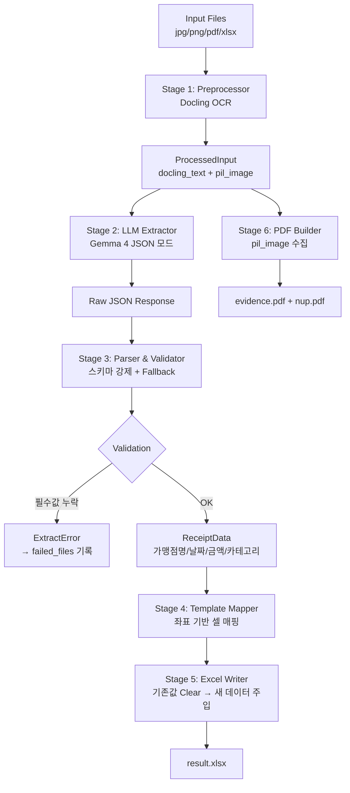

# Master Refactor Plan — 영수증 변환 시스템

> **이 문서는 모든 개발의 최상위 가이드라인이다.**  
> 새 작업을 시작하기 전 반드시 이 문서를 먼저 읽고, 현재 작업이 전체 맥락에 맞는지 확인하라.

**작성일:** 2026-04-29  
**상태:** Phase 1(분석) 완료 → **Phase 2(코어 파이프라인 리팩터링) 진행 대기**  
**관련 구현 Phase:** Phase 2 → Phase 3 → (기존 Phase 4, 5 유지)

---

## 0. 현재 코드 상태 (2026-04-29 기준)

| 파일 | 상태 | 비고 |
|------|------|------|
| `app/schemas/receipt.py` | ✅ 양호 | `가맹점명`, `카테고리`, `ExpenseCategory` — 올바른 스키마 |
| `app/schemas/job.py` | ✅ 양호 | `nup_pdf_url`, `user_id` 포함 |
| `app/services/preprocessor/` | ✅ 양호 | Docling 기반 `docling_text` 모드 |
| `app/services/ollama_client.py` | ✅ 기본 동작 / ⚠️ 개선 필요 | `_SYSTEM_PROMPT` 존재하나 `validate_and_fix()` 미구현 |
| `app/services/excel_mapper.py` | ❌ **재작성 필요** | `clear_data_rows()` 없음, 수식 컬럼 보호 없음, 혼합 모드 미지원 |
| `app/services/template_analyzer.py` | ⚠️ **수정 필요** | `formula_cols`, `data_end_row` 미지원 |
| `app/services/batch_processor.py` | ⚠️ **수정 필요** | `ExtractError` 처리 없음 |
| `app/core/config.py` | ⚠️ **수정 필요** | `_DEFAULT_PROMPT` 구식 스키마 사용 |
| `app/services/file_manager.py` | ✅ 양호 | `data/users/{user_id}/jobs/{job_id}/` 격리 |
| `app/services/nup_pdf.py` | ✅ 양호 | N-up PDF 생성 완료 |

---

---

## 1. 현재 버그 원인 분석 (코드 레벨)

### Bug 1: 템플릿 원본 값 잔류 (Template Contamination)

**증상:** 결과 Excel에 이전 더미 데이터(2월 영수증)가 그대로 남아 있음.

**코드 경로:**
```
batch_processor.py:run_job()
  → build_excel(tpl_path, xlsx_path, receipts, tpl_config)
    → shutil.copy2(template_path, output_path)   ← 원본 전체 복사
    → _write_category_mode(ws, cfg, receipts)
      → _first_empty_data_row(ws, cfg)           ← 첫 번째 빈 행 탐색
```

**근본 원인:**
1. `shutil.copy2`가 기존 데이터가 채워진 템플릿을 그대로 복사
2. `_first_empty_data_row()` 는 `DATA_START`(row 9)부터 스캔해 A열이 비어있는 첫 행을 찾음
3. 실제 템플릿(tpl_cce75043)은 A9~A17에 기존 날짜 데이터 존재 → row 18 반환
4. 새 데이터는 row 18부터 기록, **row 9~17의 기존 데이터는 절대 지워지지 않음**
5. 결과: 출력 파일 = 기존 2월 데이터 + 새 영수증 데이터 혼재

**실제 템플릿 구조 확인:**
```
Row 9:  A=2026-02-06, B=신용정보원, L=12000, O=그라츠과자점 / 중식  ← 기존 더미
...
Row 17: A=2026-02-27, B=신용정보원, L=16000, O=미궁 / 중식         ← 기존 더미
Row 23: A=합계, E='=SUM(F23:O23)', F='=SUM(F9:F22)'               ← 합계 행
```

---

### Bug 2: FIELD_금액 → 합계(E) 컬럼 오매핑 (Wrong Column Mapping)

**증상:** 금액이 카테고리 컬럼(L=식대, G=여비교통비)에 입력되지 않고 합계 수식 셀(E)에 쓰여 수식이 파괴됨.

**코드 경로:**
```python
# template_analyzer.py: _analyze_field_mode()
FIELD_금액 → ('26.02_개인', '$E$7') → col = 'E' → total_col = 'E'

# excel_mapper.py: _write_field_mode()
mapping["가맹점명"] = col_idx('E')  # E열에 금액 기록 → SUM 수식 덮어쓰기!
```

**근본 원인:**
1. 템플릿의 Named Range `FIELD_금액`이 E7(합계 수식 헤더)을 가리킴
2. 실제 금액은 카테고리별 컬럼(F=항공료, G=버스택시, H=숙박비, I=유류대, J=주차통행료, L=식대, M=접대비, N=기타비용)에 넣어야 함
3. 현재 코드는 FIELD_* Named Range만 보고 필드모드로 동작 → 카테고리 컬럼 무시
4. E열은 `=SUM(F9:N9)` 수식이어야 하는데 숫자값이 덮어씌워져 합계 기능 파괴

**실제 템플릿 컬럼 구조:**
```
Col A: 일자        (FIELD_날짜 → A7)
Col B-D: 거래처/프로젝트명  (FIELD_업체명 → B7)
Col E: 합계 =SUM(F:N)  ← 수식 보존 필수 (FIELD_금액이 잘못 가리킴)
Col F: 항공료
Col G: 버스,택시 (여비교통비)
Col H: 숙박비
Col I: 유류대
Col J: 주차,통행료
Col L: 식대
Col M: 접대비
Col N: 기타비용    ← 영수증 카테고리에 따라 이 중 하나에 금액 기록
Col O: 비고        (FIELD_비고 → O7)
```

---

### Bug 3: 혼합 모드 미지원 (Hybrid Template Not Handled)

**증상:** FIELD_* Named Range + 카테고리 컬럼이 공존하는 템플릿에서 분기 오류.

**근본 원인:**
1. `analyze()` 함수가 FIELD_* Named Range 존재 시 무조건 "field 모드" 사용
2. 실제 템플릿은 Named Range(날짜/거래처/합계/비고) + 카테고리 컬럼(식대/접대비/여비교통비)이 혼재
3. field 모드는 카테고리 컬럼을 전혀 인식하지 못함
4. 결과: 금액이 수식 셀에 쓰이고, 카테고리 컬럼은 모두 빈 상태

---

### Bug 4: Null 과다 발생 (Excessive Null Values)

**증상:** LLM이 필드를 추출 못하거나 null을 반환해도 그대로 엑셀에 기록됨.

**코드 경로:**
```python
# batch_processor.py
receipt = await ollama.extract_receipt(processed, system_prompt)
receipts.append(receipt)   ← 검증 없이 바로 추가

# excel_mapper.py: _write_field_mode()
ws.cell(row=row, column=col_idx, value=data.get(field))   ← null 그대로 기록
```

**근본 원인:**
1. 추출 결과에 대한 Validation이 없음 (`금액=0`, `날짜=null` 허용)
2. `config.py`의 `_DEFAULT_PROMPT`가 구식 스키마(`업체명`, `품목`) 사용 — 현재 `ReceiptData`와 불일치
3. Fallback 로직 없음: 날짜 파싱 실패 시 그냥 null 저장
4. 금액이 0이거나 None인 경우에도 엑셀 행을 생성

---

### Bug 5: 프롬프트 스키마 불일치 (Schema Mismatch in Prompt)

**증상:** `config.py`의 기본 프롬프트가 구식 스키마를 요청해 LLM 응답이 불안정함.

```python
# config.py: _DEFAULT_PROMPT (현재 코드)
"업체명", "품목", "금액", "부가세"  ← 구식 스키마

# schemas/receipt.py (현재 코드)
가맹점명, 프로젝트명, 금액, 카테고리  ← 현재 스키마
```

현재 `batch_processor.py`는 `template.custom_prompt or None`을 사용하므로 `config.ollama_system_prompt`는 실질적으로 무시되지만, 코드가 혼란스럽고 언제든 잘못 사용될 수 있음.

---

## 2. 신규 아키텍처 (Target Architecture)

### 2.1 데이터 파이프라인 (완전 단계 분리)



### 2.2 Template Mapping Layer 상세 설계

**핵심 원칙: 하드코딩 금지, 좌표 기반 매핑**

```python
@dataclass
class TemplateMap:
    """템플릿 1장의 쓰기 좌표 정의."""
    sheet_name: str
    date_col: str           # 'A'  — 날짜 기록 열
    project_col: str | None # 'B'  — 거래처/프로젝트명 (병합셀 B-D)
    total_col: str | None   # 'E'  — 합계 수식 열 (쓰기 금지, 수식 보존)
    note_col: str | None    # 'O'  — 비고(가맹점명) 열
    data_start_row: int     # 9    — 데이터 첫 행
    data_end_row: int       # 22   — 데이터 마지막 행 (합계 행 - 1)
    sum_row: int | None     # 23   — 합계 행 (삭제 금지)
    category_cols: dict[str, str]  # {'식대': 'L', '접대비': 'M', ...}
    formula_cols: set[str]         # {'E'} — 절대 덮어쓰기 금지 열
```

**데이터 기록 흐름:**
```python
def write_receipt(ws, tm: TemplateMap, receipt: ReceiptData, row: int) -> None:
    # 1. 날짜 (A열)
    ws[f"{tm.date_col}{row}"] = parse_date(receipt.날짜)

    # 2. 거래처/프로젝트 (B열 — B,C,D 병합구조)
    if tm.project_col:
        ws[f"{tm.project_col}{row}"] = receipt.프로젝트명

    # 3. 합계 수식 재생성 (E열 — 숫자 직접 쓰기 금지!)
    if tm.total_col and tm.category_cols:
        cols = sorted(tm.category_cols.values())
        ws[f"{tm.total_col}{row}"] = f"=SUM({cols[0]}{row}:{cols[-1]}{row})"

    # 4. 카테고리 컬럼에 금액 기록
    cat_col = tm.category_cols.get(receipt.카테고리) \
              or tm.category_cols.get("기타비용")    # fallback
    if cat_col:
        ws[f"{cat_col}{row}"] = receipt.금액

    # 5. 비고 (O열 — 가맹점명)
    if tm.note_col:
        ws[f"{tm.note_col}{row}"] = receipt.가맹점명
```

**템플릿 Clear 로직 (쓰기 전 반드시 실행):**
```python
def clear_data_rows(ws, tm: TemplateMap) -> None:
    """DATA_START ~ data_end_row 범위의 모든 값을 지운다. 수식 열(E)은 수식 재생성."""
    for row in range(tm.data_start_row, tm.data_end_row + 1):
        for col in ws.iter_cols(min_row=row, max_row=row):
            cell = col[0]
            if cell.column_letter not in tm.formula_cols:
                cell.value = None  # 기존 더미 데이터 삭제
```

### 2.3 Validation & Fallback Layer

```python
class ExtractError(Exception):
    def __init__(self, field: str, reason: str):
        self.field = field
        self.reason = reason

def validate_and_fix(raw: dict) -> ReceiptData:
    """
    LLM 응답 dict를 검증하고 가능하면 수정, 불가능하면 ExtractError 발생.
    """
    # 날짜 정규화
    raw["날짜"] = normalize_date(raw.get("날짜", ""))
    if not raw["날짜"]:
        raise ExtractError("날짜", "날짜를 인식할 수 없습니다")

    # 금액 검증 — 필수값
    amount = raw.get("금액", 0)
    if not isinstance(amount, int) or amount <= 0:
        raise ExtractError("금액", f"유효하지 않은 금액: {amount!r}")

    # 카테고리 fallback
    if raw.get("카테고리") not in VALID_CATEGORIES:
        raw["카테고리"] = "기타비용"

    # 가맹점명 fallback
    if not raw.get("가맹점명"):
        raw["가맹점명"] = raw.get("merchant_name") or raw.get("업체명") or "알 수 없음"

    return ReceiptData.model_validate(raw)
```

### 2.4 프롬프트 통합 (단일 소스)

`config.py`의 `_DEFAULT_PROMPT` 제거. 프롬프트는 `ollama_client.py`에만 존재.

```python
# ollama_client.py의 _SYSTEM_PROMPT (현재 한국어 프롬프트 개선)
_SYSTEM_PROMPT = """You are a Korean expense receipt data extraction expert.
Given the structured text of a receipt extracted by Docling, return ONLY a JSON object.

Required fields (never omit):
- "날짜": date string in "YYYY.MM.DD" format
- "가맹점명": merchant name exactly as shown
- "금액": total payment as integer (no comma, no symbol)

Optional fields (use null if unknown):
- "프로젝트명": project name if mentioned, else null
- "부가세": VAT as integer, 0 if not shown
- "카테고리": ONE of ["식대","접대비","여비교통비","항공료","숙박비","유류대","주차통행료","기타비용"]
- "결제수단": ONE of ["카드","현금","계좌이체","기타"]

Category mapping rules:
  업종=일반대중음식/한식/중식/일식/양식 → "식대"
  업종=택시/버스/지하철/기차 → "여비교통비"
  업종=주차 → "주차통행료"
  업종=항공 → "항공료"
  업종=숙박 → "숙박비"
  업종=주유/유류 → "유류대"
  otherwise → "기타비용"

Output ONLY valid JSON. No markdown. No explanation.
Example: {"날짜":"2025.12.05","가맹점명":"스타벅스","금액":5500,"부가세":500,"카테고리":"기타비용","결제수단":"카드","프로젝트명":null}
"""
```

---

## 3. 파일별 변경 계획

| 파일 | 변경 종류 | 핵심 내용 |
|------|----------|---------|
| `app/services/excel_mapper.py` | **전면 재작성** | `TemplateMap` 도입, clear_data_rows(), write_receipt(), 수식 컬럼 보호, 좌표 기반 매핑 |
| `app/services/template_analyzer.py` | **수정** | FIELD_* + 카테고리 컬럼 혼합 모드 지원, `formula_cols` 자동 감지, `data_end_row` 계산 |
| `app/services/ollama_client.py` | **수정** | 프롬프트 개선, `validate_and_fix()` 통합, fallback 로직 추가 |
| `app/core/config.py` | **수정** | `_DEFAULT_PROMPT` 제거 또는 `_SYSTEM_PROMPT`와 동기화 |
| `app/services/batch_processor.py` | **수정** | ExtractError 처리, stage 분리 명확화 |
| `app/schemas/receipt.py` | **유지** | 현재 스키마 양호 |
| `tests/test_excel_mapper.py` | **전면 재작성** | TemplateMap 기반 테스트, clear 검증, 수식 보존 검증 |

---

## 4. Phase 2 구현 순서

1. **`TemplateMap` + `TemplateAnalyzer` 수정** — 혼합 모드 + formula_cols + data_end_row 지원
2. **`clear_data_rows()` + `write_receipt()` 구현** — 기존 더미 삭제 후 새 데이터 기록
3. **`validate_and_fix()` 구현** — LLM 응답 검증 및 fallback
4. **`ollama_client.py` 프롬프트 개선** — 스키마 강제 프롬프트
5. **`config.py` 정리** — 구식 프롬프트 제거
6. **`batch_processor.py` 수정** — ExtractError 처리 추가
7. **테스트 전면 재작성** — 각 단계별 단위 테스트
8. **실 데이터 통합 테스트** — 신한카드 PDF + 박병준 템플릿으로 end-to-end 검증

---

## 5. 검증 기준 (Definition of Done — Phase 2)

```
✅ 박병준 템플릿(tpl_cce75043) 로드 후 기존 2월 데이터 행 완전 삭제 확인
✅ 신한카드 PDF 1장 처리 시 결과 엑셀에 정확히 1행 추가 (행 9에)
✅ 금액이 E열(합계 수식)이 아닌 L열(식대)에 기록됨
✅ E열 =SUM(F9:N9) 수식이 보존됨 (수식 파괴 없음)
✅ 금액=0 또는 날짜 인식 불가 시 failed_files에 기록, 엑셀 행 추가 없음
✅ 영수증 3장 처리 시 행 9, 10, 11에 순서대로 기록
✅ 모든 테스트 통과 (pytest)
```

---

## 추가 개선: OCR Vision Hybrid (2026-05-02)

Phase 3 이후 실제 테스트에서 발견된 문제(Docling 기본 OCR가 한국어 영수증을 한자로 오인식)를
해결하기 위해 다음이 추가 구현됨:

- `DoclingService`: EasyOCR(ko+en, force_full_page_ocr=True) + 경량 파이프라인(`_make_pipeline_options()`)
  - do_table_structure, do_picture_classification, do_picture_description 비활성화
  - images_scale=2.0으로 고해상도 OCR
- `OllamaClient`: Vision hybrid — 이미지 base64 + OCR 텍스트를 동시에 gemma4에 전달
  - `_encode_image()`: PIL → base64 JPEG
  - `_build_user_prompt()`: OCR 텍스트를 힌트로 포함한 hybrid 프롬프트
  - `temperature=0.0`, 한국어 강화 system prompt (이미지 우선, 엄격 JSON 스키마)
- 상세 플랜: `docs/superpowers/plans/2026-05-02-ocr-vision-hybrid.md`
